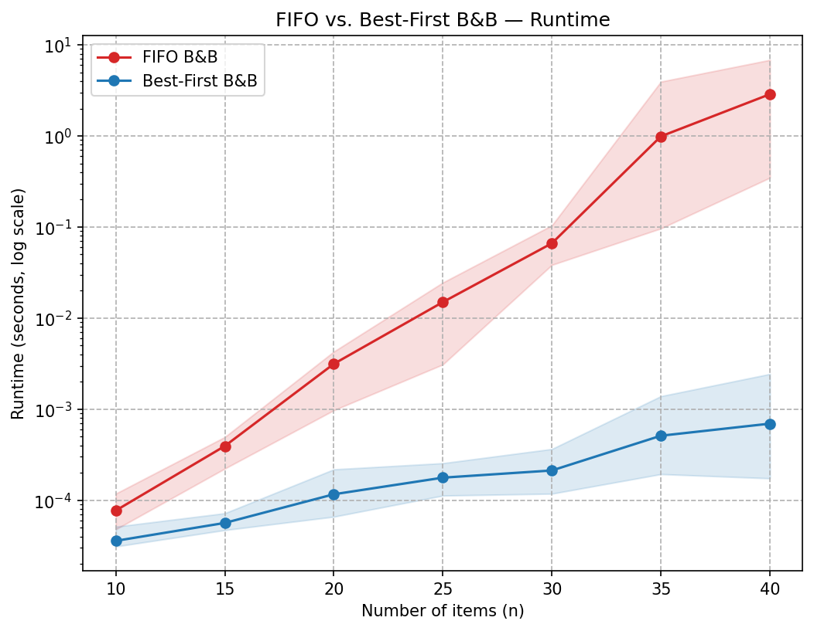
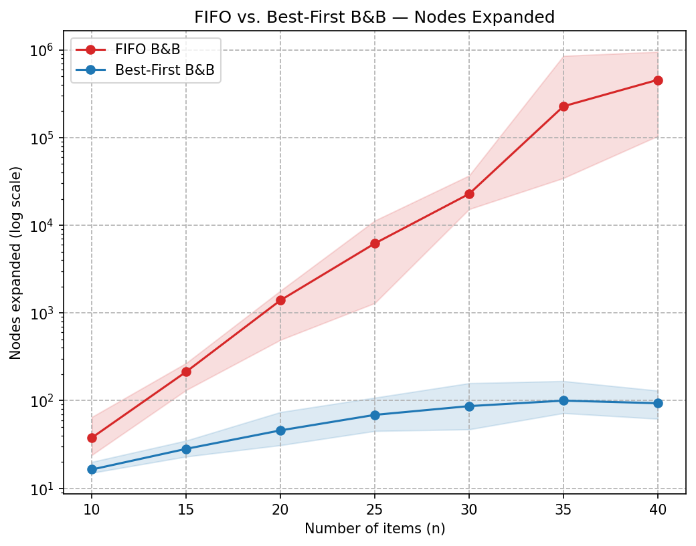

# Knapsack Branch-and-Bound Comparison

Comparing two Branch-and-Bound variants on the 0/1 Knapsack Problem: **FIFO B&B** (queue-based) vs. **Best-First B&B** (Least-Cost, priority-queue-based).

## The Problem

Given `n` items, each with a weight and a value, and a knapsack with capacity `W`, select a subset of items that maximizes total value while keeping total weight ≤ `W`. Each item is either fully taken or left behind (0/1, not fractional).

The 0/1 Knapsack Problem is **NP-hard** — no known polynomial-time algorithm solves it in general — so exact solvers fall back on search with pruning. Branch-and-Bound is the standard exact approach: enumerate the decision tree (at each level, include or exclude the next item), compute an optimistic upper bound on every partial state, and prune subtrees whose upper bound can't beat the best solution found so far.

## The Two Algorithms

Both algorithms share a single fractional-relaxation upper-bound function: at any partial state, the best possible completion value is bounded above by greedily filling the remaining capacity with whole items in value/weight ratio order, plus one fractional slice of the next item. This is what enables pruning. The only thing that differs between the two algorithms is **which live node to expand next**.

### FIFO Branch-and-Bound

- **Frontier:** plain FIFO queue (`collections.deque`)
- **Next node to expand:** whichever was enqueued earliest (breadth-first order)
- **Pros:** trivial to implement, `O(1)` enqueue/dequeue, cache-friendly
- **Cons:** no guidance — expands nodes with poor bounds just as eagerly as promising ones. The incumbent `best_value` climbs slowly, which means pruning activates late. The frontier grows to the full width of the current tree level before narrowing.

### Best-First (Least-Cost) Branch-and-Bound

- **Frontier:** min-heap (`heapq`) keyed on `-bound` so the node with the **highest** upper bound pops first
- **Next node to expand:** the one most likely to contain the optimum
- **Pros:** `best_value` rises quickly, which tightens pruning aggressively. In practice this expands orders of magnitude fewer nodes than FIFO.
- **Cons:** `O(log n)` heap operations per push/pop; more complex code; worst-case memory is still exponential if pruning fails to bite.

## Predicted Winner (before running anything)

| | FIFO B&B | Best-First B&B |
|---|---|---|
| Frontier structure | Queue (deque) | Min-heap (priority queue) |
| Per-node op cost | `O(1)` | `O(log n)` |
| Worst-case nodes explored | `O(2^n)` | `O(2^n)` |
| Expected nodes in practice | Much larger — breadth-first, no guidance toward good solutions | Much smaller — always expands the most promising node first, so `best_value` rises quickly and prunes aggressively |
| Peak frontier | Up to full tree level | Bounded by live nodes with bound > best_so_far |

**Prediction:** Best-First wins decisively on runtime, and the gap widens as `n` grows. FIFO's cheaper per-operation cost does not compensate for exploring orders of magnitude more nodes. Memory: both are `O(2^n)` worst case, but Best-First's measured peak frontier is typically smaller because pruning kicks in sooner.

## Running It

```bash
python3 -m venv .venv
source .venv/bin/activate
pip install -r requirements.txt

# Full default sweep: sizes 10..40, 5 trials each, 60s timeout
python run_benchmark.py

# Or a quick sanity run
python run_benchmark.py --sizes 10,15,20 --trials 3 --timeout 10
```

Outputs land in `results/`:
- `benchmark_YYYY-MM-DD.csv` — raw per-run data
- `runtime_vs_size.png` — runtime vs. input size, log scale
- `nodes_vs_size.png` — operation count vs. input size, log scale

## Tests

```bash
pytest
```

The correctness suite in `tests/test_correctness.py` brute-forces the optimum on 30 random instances (sizes 5, 10, and 12) and asserts both B&B solvers match.

## Results

Sweep: sizes `[10, 15, 20, 25, 30, 35, 40]`, 5 trials each, 60 s timeout per run, base seed 42. Run date: 2026-04-18.





### Summary table

| size | algo       | mean_runtime_s | mean_nodes | peak_frontier | timeouts |
| ---- | ---------- | -------------- | ---------- | ------------- | -------- |
|  10  | best_first | 0.0000         |      16.4  |       7       |    0     |
|  10  | fifo       | 0.0001         |      37.8  |      21       |    0     |
|  15  | best_first | 0.0001         |      28.2  |      13       |    0     |
|  15  | fifo       | 0.0004         |     213.6  |     101       |    0     |
|  20  | best_first | 0.0001         |      45.8  |      15       |    0     |
|  20  | fifo       | 0.0031         |    1,395.8 |     648       |    0     |
|  25  | best_first | 0.0002         |      68.8  |      27       |    0     |
|  25  | fifo       | 0.0150         |    6,205.0 |   3,608       |    0     |
|  30  | best_first | 0.0002         |      86.6  |      35       |    0     |
|  30  | fifo       | 0.0663         |   22,789.2 |   9,916       |    0     |
|  35  | best_first | 0.0005         |     100.0  |      35       |    0     |
|  35  | fifo       | 0.9901         |  227,124.0 | 243,984       |    0     |
|  40  | best_first | 0.0007         |      93.4  |      38       |    0     |
|  40  | fifo       | 2.8724         |  454,731.0 | 218,450       |    0     |

### Observations

- **Runtime at n = 40:** Best-First averaged **0.0007 s** while FIFO averaged **2.8724 s** — a **≈ 4 100× speedup** in favor of Best-First.
- **Nodes expanded at n = 40:** Best-First averaged **93** while FIFO averaged **454,731** — a **≈ 4 870× reduction** in operations.
- **Peak frontier at n = 40:** Best-First held **38** live nodes at its peak; FIFO held **218,450** — a **≈ 5 750× memory reduction** on the live-node set. This directly answers the memory-requirements question: though both algorithms are worst-case `O(2^n)`, Best-First's measured working set stayed under 40 nodes across every size tested, while FIFO's grew exponentially.
- **Growth shape on the log plots:** Best-First's curves (both runtime and nodes) are nearly flat — they grow sub-linearly on a log scale, meaning sub-exponentially in `n`. FIFO's curves rise in a straight line on a log plot, which is the signature of exponential growth.
- **No timeouts** at the 60 s budget — FIFO hit ~3 s at n=40, so pushing to n=45 or beyond is where FIFO would begin timing out first.
- **FIFO's `nodes_expanded` jumped about 9× per size step** (37 → 213 → 1,395 → 6,205 → 22,789 → 227,124 → 454,731). Best-First's stayed nearly flat past n=25 (68 → 86 → 100 → 93) because its bound-guided search finds a near-optimal incumbent quickly, and everything else gets pruned.
- **Correctness:** 30 brute-force parity tests passed across three sizes; the benchmark fixture also asserts both algorithms agree on `best_value` for every (size, trial) pair — all 35 pairs matched.

## Conclusion

**Best-First Branch-and-Bound is the clear winner** for 0/1 Knapsack in this experiment. The prediction held: the `O(log n)` priority-queue overhead is dwarfed by the savings from expanding four-to-five orders of magnitude fewer nodes. At n=40, Best-First finishes in under a millisecond while FIFO grinds through nearly half a million nodes in three seconds.

The chart shape tells the story visually: on a log scale, FIFO's curves rise in straight lines (exponential growth in `n`), while Best-First's are nearly flat (effectively polynomial on the tested range). For any instance of practical size — or any situation where input size might grow — Best-First is the right choice. FIFO remains a useful pedagogical baseline but is not a competitive exact solver for 0/1 Knapsack.
